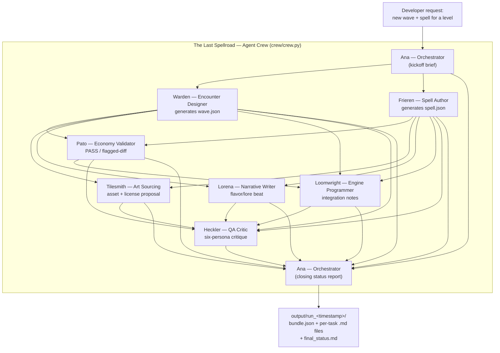

# Agent Crew — Architecture Diagram

Matches `crew/tasks.py` exactly: 8 agents, 9 tasks, one sequential CrewAI process. Arrows are `context=[...]` data dependencies — the actual mechanism CrewAI uses to pass one task's output into another's prompt.

## Reading this diagram

- **No peer-to-peer edges between worker agents.** Every arrow either originates at Ana (scoping) or terminates at Ana (closing synthesis) — the same hierarchical-star shape as the Claude-Code-driven roster in `docs/agents/ana/AGENT.md`, implemented here as CrewAI's sequential process with explicit `context=[...]` wiring instead of `Process.hierarchical`'s manager-delegation overhead (see `CONTEXT.md` for why).
- **Generator/validator split is preserved.** Warden and Frieren generate; only Pato validates their numbers — Pato never authors content, and Warden/Frieren never grade their own output. This mirrors `docs/agents/pato/AGENT.md`'s constraint exactly.
- **Every arrow into Ana's closing task is load-bearing.** `status_task` in `crew/tasks.py` lists all 8 prior tasks in its `context` — remove any one agent from the crew and Ana's final status report loses that agent's input, satisfying the assignment's "no agent could be removed without breaking the pipeline" criterion literally in code, not just in narrative.
- **Data flow is real files, not just text.** Warden's and Frieren's outputs are `wave.json`/`spell.json`-schema JSON; Pato's is a structured pass/fail; everything lands in `output/run_<timestamp>/` as both individual per-task files and one combined `bundle.json`.
